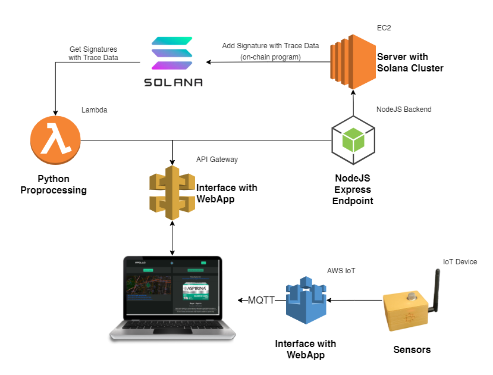
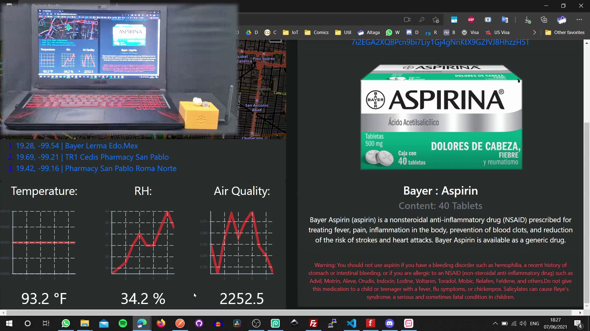

# Project-Apollo

# Table of Contents:

- [Project-Apollo](#project-apollo)
- [Table of Contents:](#table-of-contents)
- [Diagrams:](#diagrams)
  - [Software:](#software)
  - [Hardware:](#hardware)
- [Solana Cluster:](#solana-cluster)
  - [Transaction Signatures:](#transaction-signatures)
- [Platform:](#platform)
  - [Elements:](#elements)
    - [Check product:](#check-product)
    - [Add Trace:](#add-trace)
    - [Test:](#test)
- [Device:](#device)
- [Demo:](#demo)

# Diagrams:
## Software:

## Hardware:

# Solana Cluster:

The solana cluster was run on an EC2 virtual machine, all the configuration and code is in the Server folder.

To place the information on the blockchain we use an on-chain program.

This is the Program Account if you like to check it:
[Eq7k6ETwxnWP2KMdtUdAC5mvUmqCG67XiawFZwfFd8EY](https://explorer.solana.com/address/Eq7k6ETwxnWP2KMdtUdAC5mvUmqCG67XiawFZwfFd8EY?cluster=devnet)

And in order to interact with it and the on-chain code, an express server was made with NodeJS, directly connected to our API Gateway.

    const express = require("express");
    const app = express();
    const port = 8080; // default port to listen

    // Define a route handler to add new trace 
    app.get("/api", (req, res) => {
      main(req.headers.name,req.headers.loc).then((hash) => {
        res.send(hash)
      });
    });

    // Test Route

    app.get("/", (req, res) => {
        res.send("Hello Solana!")
    });

    // start the Express server
    app.listen(port, () => {
      console.log(`server started at http://localhost:${port}`);
    });

To access it from the same API Gateway we make a bridge between the server and API Gateway.

    import json
    import http.client

    def lambda_handler(event, context):
        conn = http.client.HTTPConnection("ec2-xxx-xxx-xxx-xxx.compute-1.amazonaws.com", 8080)
        payload = ''
        headers = {
        }
        conn.request("GET", "/", payload, headers)
        res = conn.getresponse()
        data = res.read()
        return {
            'statusCode': 200,
            'body': json.dumps(data.decode("utf-8"))
        }

Here is a sample of the server working.

## Transaction Signatures:

In this case we are assigning an address to each drug in order to trace it through the blockchain.

Here we can see the registry in the explorer.

[7nuexkNtPjejALaQjr4rxbkyZ6tMm5qE3BtRBbN17gTs](https://explorer.solana.com/address/7nuexkNtPjejALaQjr4rxbkyZ6tMm5qE3BtRBbN17gTs?cluster=devnet)

Here what interests us are the Transaction Signatures, since in each of these signatures the location is encrypted in latitude and longitude of the product every time someone added a trace.

Here the data we store.

The transactions signatures contain the data sent to the blockchain, through the Solana Explorer API, we are able to obtain this data in code to add it to our program.

- Signatures:

- Data from each Siganture:

All of this was added to our API to communicate directly with the website.

# Platform:
## Elements:

### Check product:

By pressing the button a QR reader will appear, which is compatible with mobile and desktop.

In the mobile version, because some cell phones have the front camera as a deafult, a camera selector was added.

Once the product has been read, we can see the trace information, the place of the last added trace will always be shown on the map, in addition to the trace data, product information will be displayed.

### Add Trace:

The Add Trace function is only enabled once the intermediary that receives the medicine has been logged in.

You can enable this function through the following user and password.

    User:apolloprojectchain@gmail.com
    Password:toor

To add a trace, we must first scan a product.

The data that we will see will be the same as in [Check product] (# check-product), however we will be able to see the sensor data in real time, to see the conditions of the product upon receipt.

The specifications of the IoT sensor are in this section [Device](#device).

### Test:

# Device:

For the IoT device we use a Pycom Fipy Board, which has LTE, which allows us to maintain continuous connectivity with AWS IoT.

https://pycom.io/product/fipy/

To the board we place the sensors as a shield to avoid disconnections, in addition to a battery and a case.

We put everything inside the case.

Finally the device looks like this:

All the data sent by the device is received in the Pycom Pybytes platform and is sent to AWS IoT through its integration.

Video: Click on the image

Sorry github does not allow embed videos.

