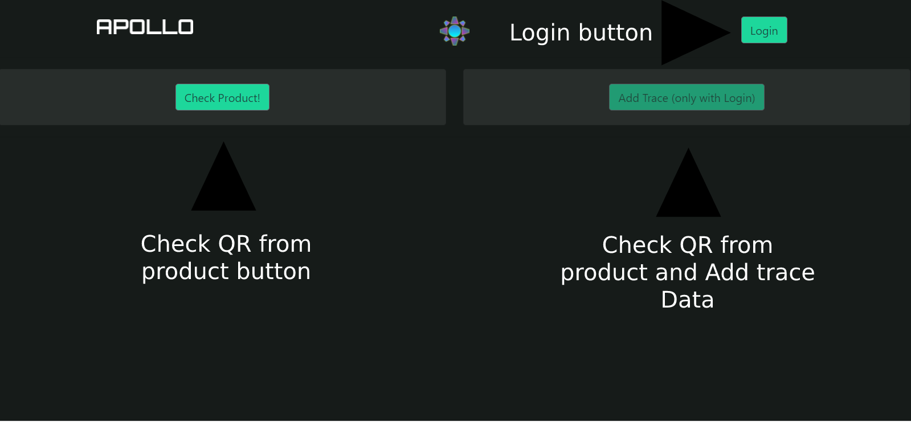

# Project-Apollo

# Table of Contents:

- [Project-Apollo](#project-apollo)
- [Table of Contents:](#table-of-contents)
- [Diagrams:](#diagrams)
  - [Software:](#software)
  - [Hardware:](#hardware)
- [Solana Cluster:](#solana-cluster)
  - [Transaction Signatures:](#transaction-signatures)
- [Platform:](#platform)
  - [Elements:](#elements)
    - [Check product:](#check-product)
    - [Add Trace:](#add-trace)
    - [Test:](#test)
- [Device:](#device)
- [Demo:](#demo)

# Diagrams:
## Software:

## Hardware:

# Solana Cluster:

El cluster de solana se hizo correr en una maquina virtual de EC2, toda la configuracion y codigo esta en la carpeta Server.

Para colocar la informacion en la blockchain utilizamos un on-chain program.

Esta es la Program Account si gustan revisarla:
[Eq7k6ETwxnWP2KMdtUdAC5mvUmqCG67XiawFZwfFd8EY](https://explorer.solana.com/address/Eq7k6ETwxnWP2KMdtUdAC5mvUmqCG67XiawFZwfFd8EY?cluster=devnet)

Y para poder interactuar con el y el codigo on-chain se realizo un servidor express con NodeJS, conectado directamente a nuestra API Gateway.

    const express = require("express");
    const app = express();
    const port = 8080; // default port to listen

    // Define a route handler to add new trace 
    app.get("/api", (req, res) => {
      main(req.headers.name,req.headers.loc).then((hash) => {
        res.send(hash)
      });
    });

    // Test Route

    app.get("/", (req, res) => {
        res.send("Hello Solana!")
    });

    // start the Express server
    app.listen(port, () => {
      console.log(`server started at http://localhost:${port}`);
    });

Para acceder a el desde la misma API Gateway realizamos un puente entre el servidor y API Gateway.

    import json
    import http.client

    def lambda_handler(event, context):
        conn = http.client.HTTPConnection("ec2-xxx-xxx-xxx-xxx.compute-1.amazonaws.com", 8080)
        payload = ''
        headers = {
        }
        conn.request("GET", "/", payload, headers)
        res = conn.getresponse()
        data = res.read()
        return {
            'statusCode': 200,
            'body': json.dumps(data.decode("utf-8"))
        }

Aqui una muestra de el servidor funcionando.

## Transaction Signatures:

En este caso estamos asignando un address a cada medicamento con el fin de poderlo trazar a travez de la blockchain.

Aqui podemos ver el registro en el explorador.

[7nuexkNtPjejALaQjr4rxbkyZ6tMm5qE3BtRBbN17gTs](https://explorer.solana.com/address/7nuexkNtPjejALaQjr4rxbkyZ6tMm5qE3BtRBbN17gTs?cluster=devnet)

Aqui lo que nos interesa son los Transaction Signatures, ya que en cada una de estas sigatures esta cifrada la localizacion en latitude y longitude del producto cada vez que alguien agrego un trace.

Aqui la data que almacenamos.

Las transactions signatures contienen los datos mandados a la blockchain, a travez de la API de Solana Explorer, nosotros somos capaces de obtener estos datos en codigo para añadirlosa nuestro programa.

- Signatures:

- Data from each Siganture:

Todo esto se agrego a nuestra API para comunicarse directamente con la pagina web.

# Platform:
## Elements:

### Check product:

Al presionar el boton aparecera un lector de QR, el cual es compatible con mobile y desktop.

En la version mobile debido a que algunos celulares tienen como deafult la camara frontal, se agrego un selector de camara.

Una vez se ha hecho la lectura del producto, podremos ver la informacion de trace, siempre se mostrara en el mapa el lugar de la ultimo trace agregado, ademas de los datos de trace se mostrara informacion del producto.

### Add Trace:

La funcion de Add Trace solo esta habiliatada una vez se ha loggeado el intermediario que recibe la medicina.

Puedes habilitar esta funcion mediante el siguiente user y password.

    User:apolloprojectchain@gmail.com
    Password:toor

Para agregar un trace, primero deberemos escanear un producto.

Los datos que veremos seran los mismos que en [Check product](#check-product) sin embargo podremos ver los datos del sensor en tiempo real, para ver las coondiciones del producto al recibirlo.

Las especificaciones del sensor IoT estan en la seccion [Device](#device).

### Test:

# Device:

Para el dispositivo IoT utilizamos una Pycom Fipy Board, la cual tiene LTE, lo cual nos permite mantener una conectividad continua con AWS IoT.

https://pycom.io/product/fipy/

A la board le colocamos a modo de shield los sensores para evitar desconexiones, ademas de una bateria y una case.

Todo lo colocamos en el interior de la case.

Finalmente el device luce de la siguiente forma.

Todos los datos que manda el device son recibidos en la plataforma de Pycom Pybytes y estas mandadas a AWS IoT mediante su integracion.

Video: Click on the image

Sorry github does not allow embed videos.

# Demo:

Video: Click on the image

Sorry github does not allow embed videos.

