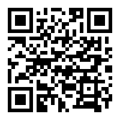
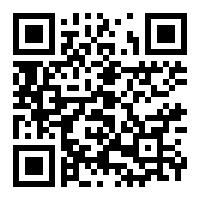
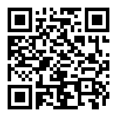
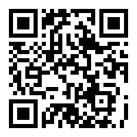
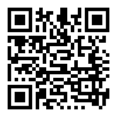
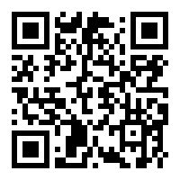
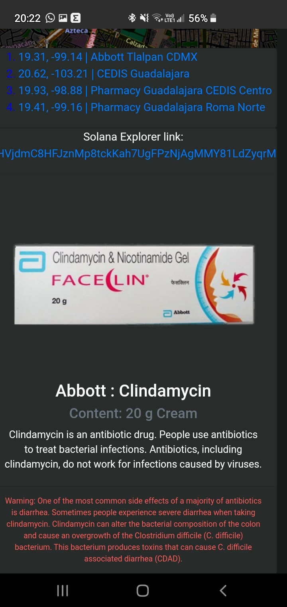
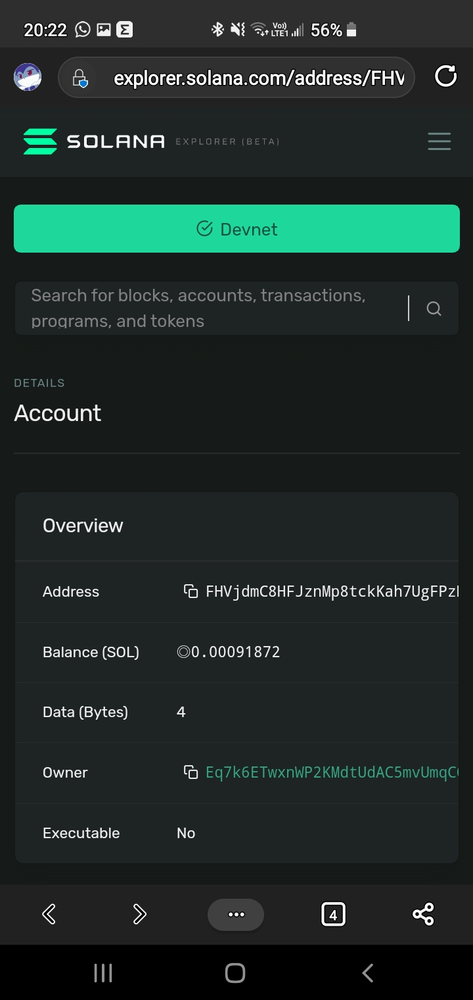
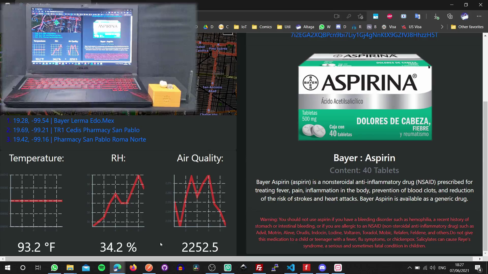

# Project-Apollo

# Table of Contents:

- [Project-Apollo](#project-apollo)
- [Table of Contents:](#table-of-contents)
- [Testing:](#testing)

# Testing:

Para probar la plataforma deberas entrar entrar desde tu celuar a ella.

https://d28h6fr0bvs87o.cloudfront.net/landing

Dentro de la plataforma tendras que presionar el boton de Check Product!

 

 

Te pedira la plataforma acceso a la camara para poder escanear los QR, le presionas Allow.

 

 

Ya que tiene acceso a las camaras, presiona el selector para elegia la camara correcta.

 

 

En este caso mi celular tiene 4 camaras, al seleccionar la camara 3, mostrara la camara posterior.

 

 

Aqui podemos ver como cambio a la camara posterior.

 

Scan any of the following QR codes with the application.

 

  
Aspirin

  

  
Clindamycin

  

  
Metronidazole

  

  
Omeprazole

  

  
Paracteamol

  

  
Valsartan

  

When scanning any of the products, we will be able to see its entire history, at each delivery point.

 

 

Al presionar cada uno de los lugares el mapa mostara la ubicacion.

 

 

En la parte inferior podremos ver los detalles del producto.

 

 

Si presionamos el hipervinculo debajo de Solana Explorer Link: poremos entrar directamente al explorer de solana para ver todos los regustros asiciados al medicamento.

 

 

Aqui un demo sin pausas de como realizar la prueba.

Video: Click on the image

Sorry github does not allow embed videos.